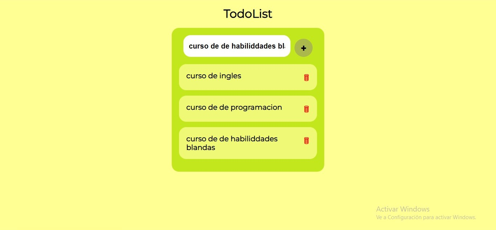

# TodoList ✍

**Este es un pequeño proyecto de practica de un TodoList para practicar el manejo arrays y manipulacion del DOM.**
**En el podras agregar distintas tareas que se te puedan prensentar y tambien tienes la opcion de poder borrar una tarea una ves que ya la hayas completado**

## El proyecto fue realizado con: 
- **HTML**
- **JavaScript**
- **CSS**

## Link:
**https://leonardo291024.github.io/TodoList/**

